# Software Studio 2023 Spring Assignment 2

### Scoring

|  **Basic Component**  | **Score** | **Check** |
|:---------------------:|:---------:|:---------:|
| Membership Mechanism  |    10%    |     N     |
| Complete Game Process |    5%     |     N     |
|      Basic Rules      |    45%    |     N     |
|      Animations       |    10%    |     N     |
|     Sound Effects     |    10%    |     N     |
|          UI           |    10%    |     N     |

|   **Advanced Component**   | **Score** | **Check** |
|:--------------------------:|:---------:|:---------:|
|        Leaderboard         |    5%     |     N     |
| Offline multi-player game  |    5%     |     N     |
|  Online multi-player game  |    15%    |     N     |
| Others [name of functions] |   1-15%   |     N     |

---

## Basic Components Description :

### Membership Mechanism

On the main page there are two buttons
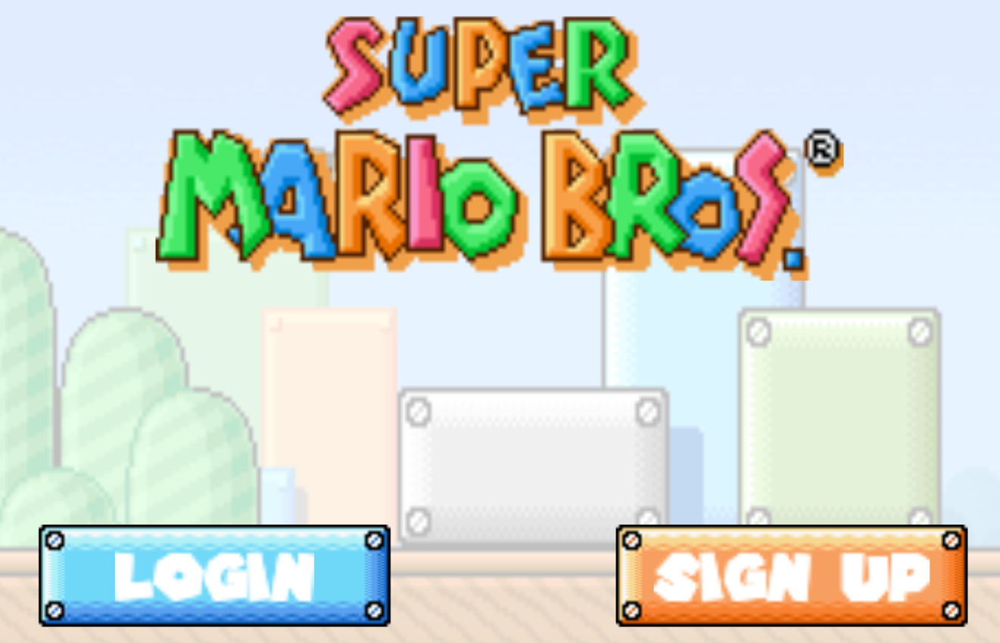

##### Sign in :

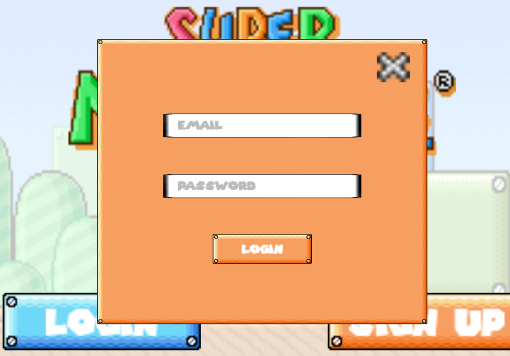

##### Sign Up :

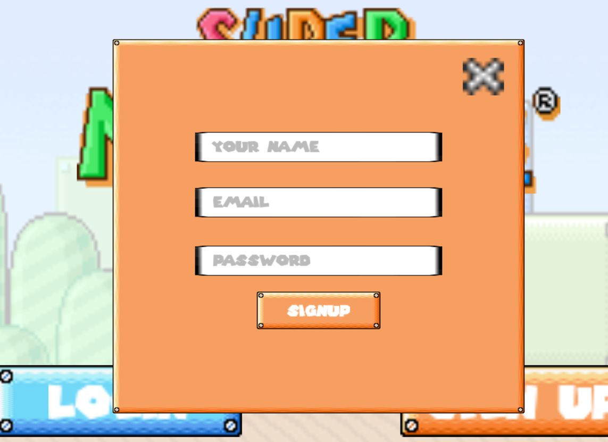

### Complete Game Process

##### Start Menu

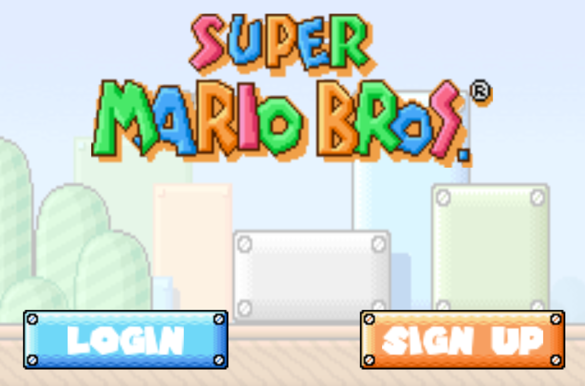

##### Level Select

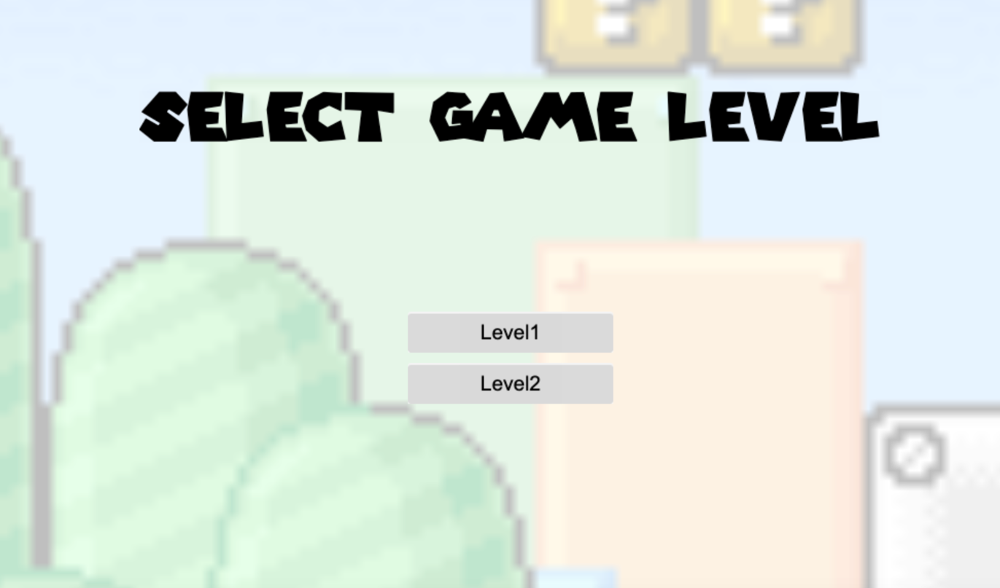

##### Game View

###### Game Start (Game is loading)

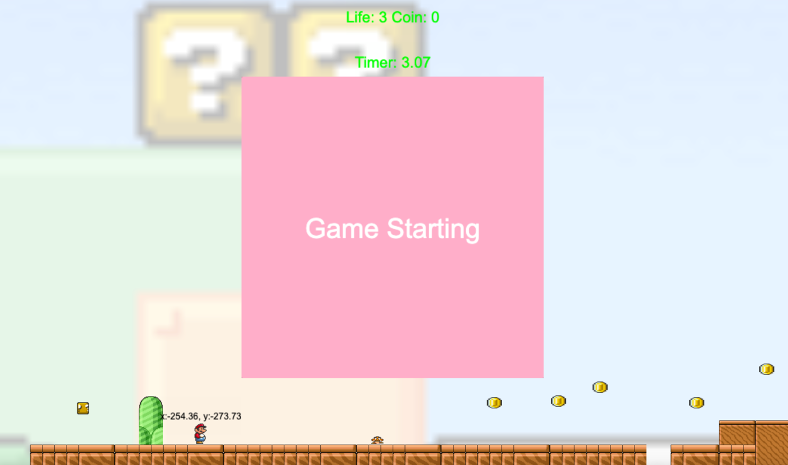

###### In Game

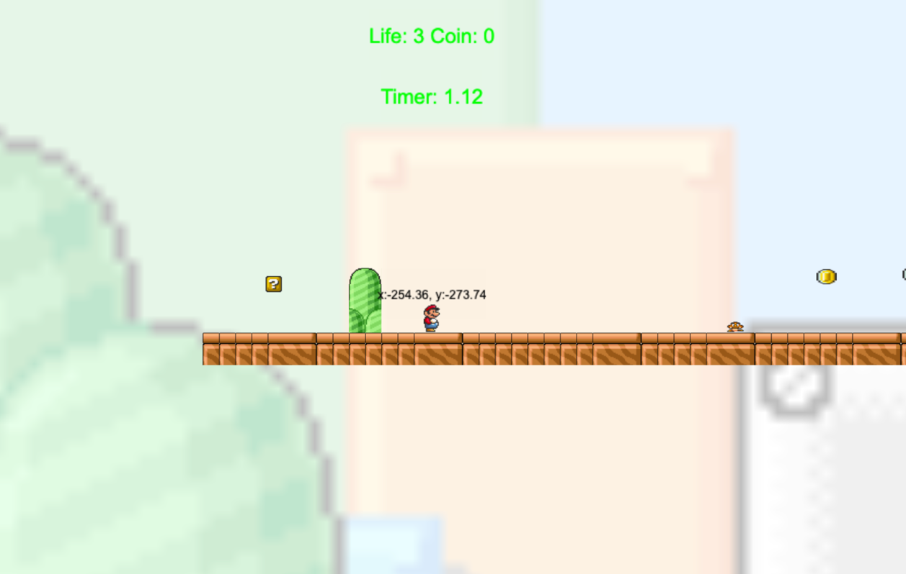

###### Game Over (win)

when user reach the end of the map, game over, and the user win
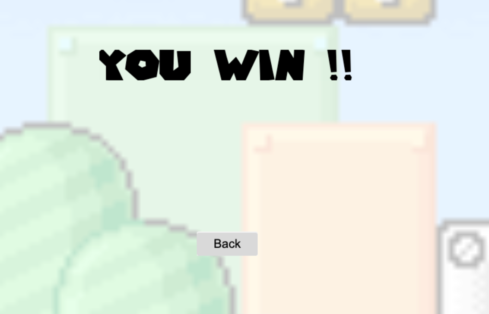

###### Game Over (lose)

if user's life is 0, game over
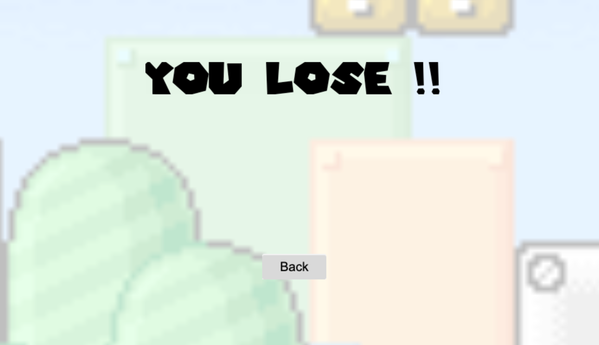

### Basic Rules

##### World Map

###### Correct physics properties

Here is some example of the correct physics properties

- Falling coin and mushroom
  

###### Background & Camera move with player

###### At least two different world maps
There are two maps
1. Level1
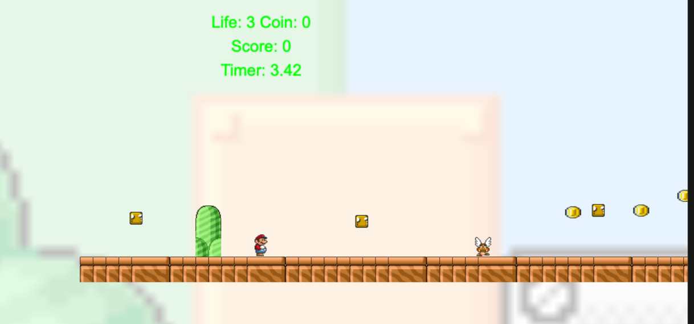
2. Level2

##### Level Design

###### The scene should have “Static” wall

The green rectangle is the static wall, and it's invisible in the game
The enemy can't pass through the static wall
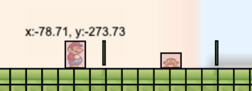

There is also a static wall on the left of the map, it can prevent user from falling out of the map
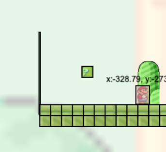

###### Question Blocks

The question block can generate two different items, coin and mushroom
The coin will fall down after it's generated, if it touches the ground, it'll fall down and user gets the coin

##### Player

###### Player should have correct physics properties.

###### User can control the player to move and jump by keyboard.

The player is movable, by pressing WSD, the player can move left, right and jump

###### Player touch enemy

If player touch enemy, player will lose one life  

###### Out of the bounds, the number of its life will decrease.

The user falls down, and the life decrease from 3 to 2  

###### Reborn

After the player lose one life, the player will reborn at the start point  

##### Enemies:

###### Enemies should have correct physics properties.

###### At least two different types of enemies.

Requirements:

- There must be significant difference between different types of enemies.
- Only when player hits on their heads can kill them.

1. Mushroom

- The mushroom will move left and right, and it will change direction when it touches the wall
- The user will lose one life if the user touches the mushroom
- The mushroom will die if the user jumps on it
  

2. Flower
   The flower will generate some bullets, if the user touches the bullet, his life will decrease.  
   Also, if you touched the flower itself, you will lose one life
   But if you jump on the flower, you will kill the flower, and it won't generate bullet anymore
   

##### Question Blocks

###### At least two different types of blocks.

1. Coin Question Block
   It can generate coins, and the coins will fall down after it's generated, if it touches the ground, it'll fall down
   and user gets the coin  
   

2. Mushroom Generator
   It can generate mushroom, and the mushroom will move left and right, and it will change direction when it touches the
   wall  
   

The question block will be randomly chosen from the two types of question blocks above

##### Animations (10%)

###### Player has walk & jump animations (5%)

###### Enemies Animation (each for 2%, up to 5%)

- Mushroom Animation
  

- Flower Animation
- 

##### Sound Effects (10%)

###### At least one BGM (2%)
OK
###### Player Jump & die sound effects (3%)
OK
###### Additional sound effects (each for 1%, up to 5%)
- Get a coin
- user lost life
- mushroom die
- player got hurt
- the bullet hit the player
###### All sound effects can’t stop BGM
OK
##### UI (10%)

###### Player life(the number of life must be able to read & write on firebase) (3%)
###### Player score(the score must be able to read & write on firebase)  (5%)
###### Timer (2%)

# Firebase page link
https://ss-as3-mario.web.app/